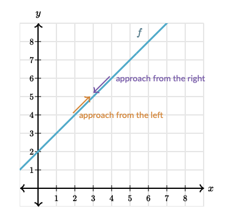
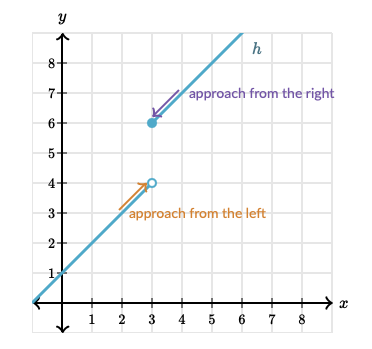
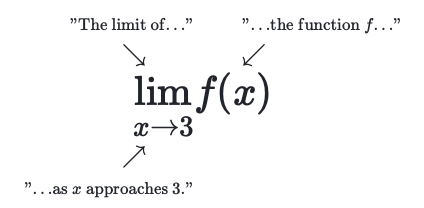

# Khan Academy: Calculus 1 - Unit 1

## Lesson 1: Limits Intro 

- Limits: A limit describes the behavior of a function as the input (x) approaches a specific value—even if the function doesn’t actually reach that value. 
    - You can approach a limit from the "left" and from the "right".
    
    

    - When a limit doesn't approach the same value from both the left and right sides, the **limit does not exist**.

    

Limit Notation:

## Lesson 2: Estimating Limits From Graphs 

- Unbounded Limit: An unbounded limit occurs when the value of a function increases or decreases without bound (i.e., grows infinitely large or small) as the input approaches a certain value.
    - When a limit is *unbounded* the limit **Does Not Exisit**.

- One-sided Limits: A one-sided limit describes the behavior of a function as x approaches a specific value from only one side—either the left or the right.
    - Left-hand Limit: defined with a negative superscript on the limit notation. 
    - Right-hand Limit: defined with a positive superscript on the limit notation.
    - If the limits defined from each direction are not the same, the limit **Does Not Exist**.