# Khan Academy: Calculus 1 - Unit 1

## Lesson 1: Limits Intro 

- Limits: A limit describes the behavior of a function as the input (x) approaches a specific value—even if the function doesn’t actually reach that value. 
    - You can approach a limit from the "left" and from the "right".
    
    

    - When a limit doesn't approach the same value from both the left and right sides, the **limit does not exist**.

    

Limit Notation:

## Lesson 2: Estimating Limits From Graphs 

- Unbounded Limit: An unbounded limit occurs when the value of a function increases or decreases without bound (i.e., grows infinitely large or small) as the input approaches a certain value.
    - When a limit is *unbounded* the limit **Does Not Exisit**.

- One-sided Limits: A one-sided limit describes the behavior of a function as x approaches a specific value from only one side—either the left or the right.
    - Left-hand Limit: defined with a negative superscript on the limit notation. 
    - Right-hand Limit: defined with a positive superscript on the limit notation.
    - If the limits defined from each direction are not the same, the limit **Does Not Exist**.

## Lesson 3: Creating Tables for Approximating Limits

- Use an input/output table to estimate the limit of a function as x approaches a specific value by choosing input values that are very close to the target x-value from both the left and right. Then observe the trend in the output values f(x) to determine what value the function is approaching.

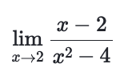

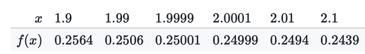

## Lesson 4: Formal Definition of Limits (Epsilon-delta)

- Sum Property: The limit of two different functions can be added if both limits exist and approach finite values as x approaches the same point.

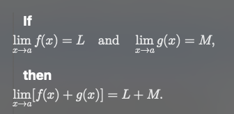

- Difference Property: The limit of two different functions can be subtracted if both limits exist and approach finite values as x approaches the same point.
    
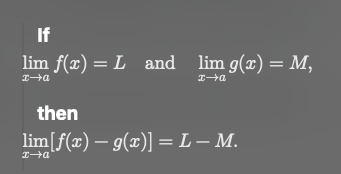

- Product Property: The limit of two different functions can be multiplied if both limits exist and approach finite values as x approaches the same point.
    - Applies to constant applied to the the function.

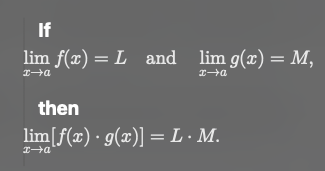

- Quotient Property: The limit of two different functions can be divided if both limits exist and approach finite values as x approaches the same point.

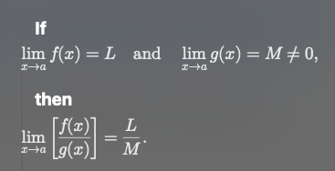

- Epsilon-delta:

    - Epsilon (ε): Represents how close f(x) is to the limit L.

    - Delta: Represents how close x must be to a (but not equal to a) to make f(x) fall within ε of L.
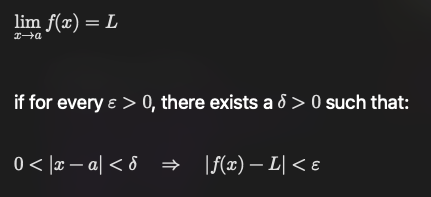
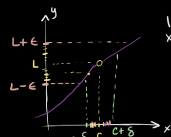

## Lesson 5: Properties of Limits

## Lesson 6: 
- Limits By Direct Substitution
    - A function is continuous at x = a *if and only if* the limit of f(x), as x approaches a, is equal to f(a).

- Limits of Trigonometric Functions

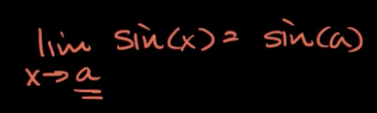

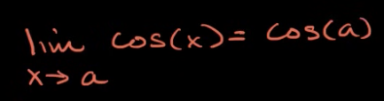

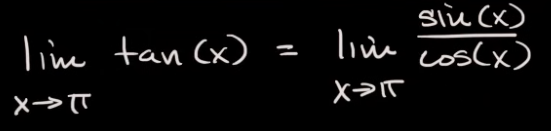

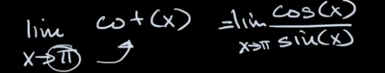

- Limits of Piecewise Functions

- Limit at a Point of Discontinuity

## Lesson 6: Limits by Factoring

## Lesson 7: Limits by Rationalizing

